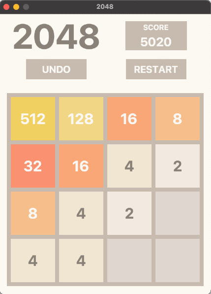
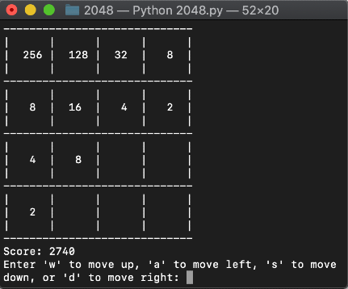

# 2048

A Python clone of the game [2048 by Gabriele Cirulli](https://github.com/gabrielecirulli/2048). Includes both a terminal version and a GUI version made with Tkinter.

To play the GUI version of the game: 
```
python3 2048.py
```


To play the terminal version of the game:
```
python3 2048.py -t
```
